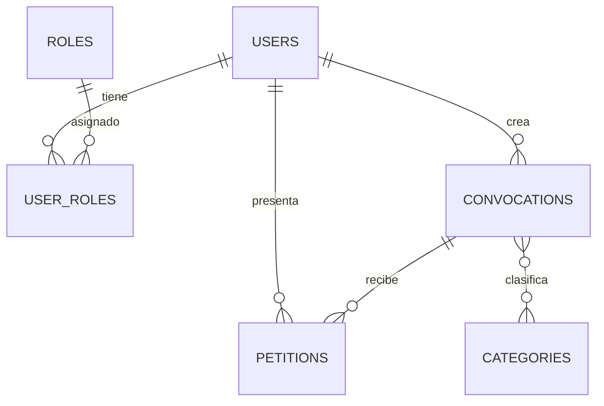

# Sistema de Convocatorias — USCO

Aplicación web para la gestión de convocatorias universitarias. Permite crear y publicar convocatorias, inscribir estudiantes, aprobar o rechazar solicitudes y consultar reportes estadísticos.
[Ver en producción](https://dynamic-friendship-production-143c.up.railway.app/login)

## Stack tecnológico

| Capa        | Tecnología                                      |
|-------------|-------------------------------------------------|
| Frontend    | Angular 20, TypeScript, SweetAlert2             |
| Backend     | Spring Boot 3.5, Java 17, Spring Security, JWT  |
| Base de datos | PostgreSQL 17, Flyway                         |
| Infraestructura | Docker Compose, Adminer, Railway (producción) |

## Arquitectura general

```
┌─────────────┐     HTTP/JWT      ┌─────────────┐     JDBC      ┌────────────┐
│   Angular   │ ◄──────────────► │ Spring Boot │ ◄───────────► │ PostgreSQL │
│  :4200      │                   │   :8080     │               │   :5432    │
└─────────────┘                   └─────────────┘               └────────────┘
                                         ▲
                                         │ Adminer :8081
```

## Requisitos previos

- [Docker](https://www.docker.com/) y Docker Compose
- Opcional (desarrollo local sin Docker): Java 17+, Maven 3.9+, Node.js 22+, PostgreSQL 17

## Inicio rápido con Docker

1. Clona el repositorio y entra al directorio del proyecto.

2. Crea el archivo de variables de entorno:

```bash
cp .env.example .env
```

Edita `.env` y define un `JWT_SECRET` seguro (mínimo 32 caracteres).

3. Levanta todos los servicios:

```bash
docker compose up --build
```

4. Accede a la aplicación:

| Servicio   | URL                          |
|------------|------------------------------|
| Frontend   | http://localhost:4200        |
| Backend API | http://localhost:8080       |
| Adminer (DB) | http://localhost:8081      |

### Credenciales por defecto (seed)

Tras la primera migración Flyway se crean tres usuarios de prueba:

| Rol       | Email                   | Password    |
|-----------|-------------------------|-------------|
| `ADMIN`   | `admin@example.com`     | `123456789` |
| `TEACHER` | `teacher@example.com`   | `123456789` |
| `STUDENT` | `student@example.com`   | `123456789` |

> Cambia estas credenciales en entornos reales.

### Adminer — conexión a PostgreSQL

| Campo    | Valor          |
|----------|----------------|
| Sistema  | PostgreSQL     |
| Servidor | `postgres`     |
| Usuario  | `postgres`     |
| Contraseña | valor de `DB_PASSWORD` en `.env` |
| Base de datos | valor de `DB_NAME` en `.env` |

## Desarrollo local (sin Docker)

### Backend

```bash
cd backend
./mvnw spring-boot:run
```

Variables requeridas: `DB_HOST`, `DB_PORT`, `DB_NAME`, `DB_USER`, `DB_PASSWORD`, `JWT_SECRET`.

### Frontend

```bash
cd frontend
npm install
npm start
```

La URL del API se configura en `frontend/src/environments/environment.ts`:

```typescript
apiUrl: 'http://localhost:8080/api/v1'
```

## Estructura del proyecto

```
usco/
├── backend/                 # API REST (Spring Boot)
│   └── src/main/java/com/usco/convocatoria/
│       ├── app/             # Módulos de negocio
│       │   ├── auth/
│       │   ├── user/
│       │   ├── categories/
│       │   ├── convocations/
│       │   ├── petitions/
│       │   └── reports/
│       ├── common/          # DTOs, mappers, respuestas comunes
│       ├── security/        # JWT, filtros, configuración
│       └── exception/       # Manejo global de errores
├── frontend/                # SPA Angular
│   └── src/app/
│       ├── core/            # Servicios, guards, modelos
│       ├── pages/           # Pantallas (auth, dashboard, categories, convocations, petitions, reports)
│       ├── layout/          # Layout principal
│       ├── interceptors/    # Interceptor JWT
│       └── shared/          # Componentes reutilizables
├── database/init/           # Scripts SQL de inicialización (Docker)
├── docs/                    # Documentación técnica y entregables
│   ├── DOCUMENTACION_TECNICA.md
│   ├── Justificacion_Tecnica.docx
│   ├── Diagrama_ER_y_Modelo_Relacional.docx
│   └── diagrama_er.png
├── docker-compose.yml
├── .env.example
├── backend/Dockerfile       # Producción (Railway)
├── backend/Dockerfile.dev   # Desarrollo local
├── frontend/Dockerfile      # Producción (Railway)
└── frontend/Dockerfile.dev  # Desarrollo local
```

## Roles y permisos

| Rol       | Permisos principales |
|-----------|----------------------|
| `ADMIN`   | CRUD de categorías; gestión de convocatorias y peticiones; reportes |
| `TEACHER` | Crear, editar, publicar y cerrar convocatorias; consultar categorías y reportes; revisar peticiones |
| `STUDENT` | Inscribirse en convocatorias publicadas; consultar el estado de sus peticiones |

## Módulos principales

| Módulo          | Descripción |
|-----------------|-------------|
| **Autenticación** | Registro, login, perfil (`/me`), logout con blacklist de JWT |
| **Categorías**    | CRUD (solo ADMIN); consulta (ADMIN y TEACHER) |
| **Convocatorias** | Ciclo de vida `BORRADOR → PUBLICADA → CERRADA`; cupos y fechas de inscripción |
| **Peticiones**    | Inscripción de estudiantes; estados `PENDIENTE`, `APROBADA`, `RECHAZADA` |
| **Reportes**      | Estadísticas por categoría, convocatoria y estado de peticiones |

### Rutas del frontend

| Ruta                    | Roles permitidos        |
|-------------------------|-------------------------|
| `/dashboard`            | Todos (autenticados)    |
| `/categories`           | ADMIN, TEACHER          |
| `/convocations`         | Todos (autenticados)    |
| `/convocations/new`       | ADMIN, TEACHER          |
| `/convocations/:id/edit`  | ADMIN, TEACHER          |
| `/petitions`              | ADMIN, TEACHER, STUDENT |
| `/reports`                | ADMIN, TEACHER          |

### API REST (`/api/v1`)

| Recurso         | Endpoints principales |
|-----------------|-----------------------|
| `/auth`         | `POST /register`, `POST /login`, `GET /me`, `POST /logout` |
| `/categories`   | `POST /create`, `GET /all`, `GET /{id}`, `PUT /{id}`, `DELETE /{id}` |
| `/convocations` | `POST /create`, `GET /all`, `GET /{id}`, `PUT /{id}`, `DELETE /{id}`, `PUT /{id}/publish`, `PUT /{id}/close` |
| `/petitions`    | `POST /create`, `GET /all`, `GET /{id}`, `PUT /{id}` |
| `/reports`      | `GET /convocations-categories`, `GET /petitions-convocations`, `GET /petitions-states` |

Todas las respuestas usan el envelope `ApiResponse<T>` con paginación vía `ApiPage<T>` (`?page=0&size=10`).

## Modelo de datos

El sistema persiste **7 tablas** en PostgreSQL: `users`, `roles`, `user_roles`, `categories`, `convocations`, `convocation_categories` y `petitions`.



**Tipos ENUM:** `state_user` (ACTIVE, INACTIVE, BLOCKED), `convocations_states` (BORRADOR, PUBLICADA, CERRADA), `petition_state` (PENDIENTE, APROBADA, RECHAZADA).

**Reglas clave:** soft delete en todas las entidades (`deleted_at`), una petición activa por usuario y convocatoria, índices únicos parciales sobre registros no eliminados.

## Documentación técnica

| Documento | Descripción |
|-----------|-------------|
| [Documentación técnica completa](docs/DOCUMENTACION_TECNICA.md) | Arquitectura, endpoints, seguridad, reglas de negocio y despliegue |
| [Justificación técnica](docs/Justificacion_Tecnica.docx) | Escalabilidad y decisiones de diseño |
| [Diagrama ER y modelo relacional](docs/Diagrama_ER_y_Modelo_Relacional.docx) | Diagrama entidad-relación y tablas con tipos, claves e índices |
| [Diagrama ER (imagen)](docs/diagrama_er.png) | Representación visual del modelo de datos |

Para regenerar los documentos Word:

```bash
python docs/generar_justificacion.py
python docs/generar_diagrama_er.py
python docs/generar_modelo_datos.py
```

## Comandos útiles

```bash
# Levantar en segundo plano
docker compose up -d --build

# Ver logs del backend
docker compose logs -f backend

# Detener servicios
docker compose down

# Detener y eliminar volúmenes (resetea la BD)
docker compose down -v

# Compilar backend
cd backend && ./mvnw compile -DskipTests

# Compilar frontend
cd frontend && npm run build
```

## Despliegue en Railway

El proyecto incluye Dockerfiles de producción en `backend/` y `frontend/`. El desarrollo local sigue usando `Dockerfile.dev` vía `docker compose`.

### Arquitectura en Railway

Necesitas **3 servicios** en un mismo proyecto de Railway:

| Servicio   | Root Directory | Descripción                    |
|------------|----------------|--------------------------------|
| PostgreSQL | (plugin)       | Base de datos                  |
| Backend    | `backend`      | API Spring Boot (JAR)          |
| Frontend   | `frontend`     | Angular compilado + Nginx      |

No despliegues Adminer en producción.

### 1. PostgreSQL

Crea el servicio con **New → Database → PostgreSQL**.

### 2. Backend

1. Conecta el repositorio y establece **Root Directory** en `backend`.
2. Genera un dominio público (ej. `https://backend-xxx.up.railway.app`).
3. Configura las variables de entorno:

| Variable | Valor |
|----------|-------|
| `DB_HOST` | `${{Postgres.PGHOST}}` |
| `DB_PORT` | `${{Postgres.PGPORT}}` |
| `DB_NAME` | `${{Postgres.PGDATABASE}}` |
| `DB_USER` | `${{Postgres.PGUSER}}` |
| `DB_PASSWORD` | `${{Postgres.PGPASSWORD}}` |
| `JWT_SECRET` | Secreto seguro (mínimo 32 caracteres) |
| `JWT_EXPIRATION` | `86400000` |
| `SPRING_PROFILES_ACTIVE` | `prod` |

> `${{Postgres.*}}` referencia el plugin PostgreSQL. Ajusta el nombre si tu servicio tiene otro.

### 3. Frontend

1. Añade otro servicio del mismo repositorio con **Root Directory** en `frontend`.
2. Configura la variable de build (debe coincidir con la URL pública del backend):

| Variable | Valor |
|----------|-------|
| `API_URL` | `https://backend-xxx.up.railway.app/api/v1` |
| `PORT` | `80` |

3. Genera un dominio público (ej. `https://frontend-xxx.up.railway.app`).

### 4. CORS en el backend

Vuelve al servicio backend y añade:

| Variable | Valor |
|----------|-------|
| `CORS_ALLOWED_ORIGINS` | `https://frontend-xxx.up.railway.app` |

Redespliega el backend después de este paso.

### Orden recomendado

```
PostgreSQL → Backend → Frontend → actualizar CORS en Backend → redeploy Backend
```

### Verificación

| Prueba | URL esperada |
|--------|--------------|
| API accesible | `https://tu-backend.up.railway.app/api/v1/auth/login` |
| App cargando | `https://tu-frontend.up.railway.app` |

### Notas

- `API_URL` se aplica en **tiempo de build**: si cambia la URL del backend, hay que redesplegar el frontend.
- `JWT_SECRET` y `DB_PASSWORD` deben ser secretos seguros en producción.
- Cambia las credenciales del usuario admin seed tras el primer despliegue.
- Más detalle en [`.env.example`](.env.example) y [documentación técnica](docs/DOCUMENTACION_TECNICA.md).

## Licencia

Proyecto académico — Universidad del Surcolombiana (USCO).
