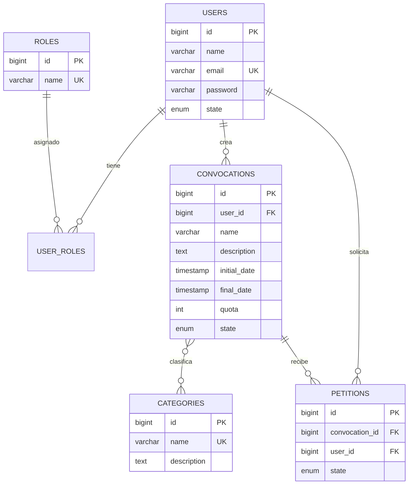

# Documentación técnica — Sistema de Convocatorias

## 1. Descripción del sistema

El sistema permite a docentes y administradores publicar convocatorias (becas, actividades, proyectos) clasificadas por categorías. Los estudiantes pueden inscribirse en convocatorias publicadas dentro del cupo disponible. El sistema genera reportes agregados para apoyar la toma de decisiones.

### 1.1 Casos de uso principales

| Actor     | Acción                                              |
|-----------|-----------------------------------------------------|
| ADMIN     | CRUD de categorías; supervisión general            |
| TEACHER   | Crear, editar, publicar y cerrar convocatorias      |
| STUDENT   | Inscribirse y consultar el estado de sus peticiones |
| ADMIN/TEACHER | Consultar reportes estadísticos               |

---

## 2. Arquitectura

### 2.1 Backend — capas

El backend sigue una organización por módulos de dominio con separación de responsabilidades:

```
interfaces/          → Controladores REST (@RestController)
application/         → DTOs de entrada/salida (request/response)
domain/
  ├── model/         → Entidades JPA
  ├── repository/    → Interfaces Spring Data JPA
  └── service/       → Lógica de negocio (@Service)
common/              → Utilidades compartidas (ApiResponse, mappers)
security/            → Autenticación JWT y autorización por roles
exception/           → GlobalExceptionHandler (@RestControllerAdvice)
```

### 2.2 Frontend — capas

```
core/
  ├── services/      → Clientes HTTP hacia la API
  ├── guards/        → authGuard, roleGuard
  ├── models/        → Interfaces TypeScript
  └── utils/         → Helpers y alertas
pages/               → Componentes standalone por pantalla
layout/              → Shell de navegación autenticada
interceptors/        → Inyección del token JWT en peticiones
shared/              → Componentes reutilizables (paginación, badges)
```

### 2.3 Comunicación

- Protocolo: HTTP/JSON
- Autenticación: Bearer JWT en header `Authorization`
- Formato de respuesta estándar: `ApiResponse<T>`

```json
{
  "success": true,
  "code": "200",
  "message": "Operación exitosa",
  "data": { },
  "timestamp": "2026-07-01T20:00:00"
}
```

Errores de validación o negocio devuelven `success: false` con código HTTP apropiado (400, 403, 404, etc.).

---

## 3. Modelo de datos

### 3.1 Diagrama entidad-relación



### 3.2 Enumeraciones

| Tipo PostgreSQL      | Valores                              | Uso                    |
|----------------------|--------------------------------------|------------------------|
| `state_user`         | ACTIVE, INACTIVE, BLOCKED            | Estado del usuario     |
| `convocations_states`| BORRADOR, PUBLICADA, CERRADA         | Ciclo de convocatoria  |
| `petition_state`     | PENDIENTE, APROBADA, RECHAZADA      | Estado de inscripción  |

### 3.3 Migraciones Flyway

| Versión | Archivo                         | Contenido                          |
|---------|---------------------------------|------------------------------------|
| V1      | `V1__create_users_and_roles.sql`| Usuarios, roles, seed admin        |
| V2      | `V2__create_categories.sql`     | Categorías y datos iniciales       |
| V3      | `V3__create_convocations.sql`   | Convocatorias y tabla intermedia   |
| V4      | `V4__create_petitions.sql`      | Peticiones e índice único user+conv|

Flyway se ejecuta automáticamente al arrancar el backend (`spring.flyway.enabled=true`). Hibernate valida el esquema (`ddl-auto=validate`) sin modificarlo.

### 3.4 Soft delete

Las entidades principales usan `@SQLDelete` + `@Where(deleted_at IS NULL)` de Hibernate para borrado lógico.

---

## 4. Seguridad

### 4.1 Autenticación JWT

| Variable         | Descripción                          | Default      |
|------------------|--------------------------------------|--------------|
| `JWT_SECRET`     | Clave HMAC para firmar tokens        | — (requerido)|
| `JWT_EXPIRATION` | Duración del token en milisegundos   | `86400000` (24 h) |

Flujo:

1. `POST /api/v1/auth/login` → devuelve token JWT.
2. Cliente envía `Authorization: Bearer <token>` en peticiones protegidas.
3. `JwtAuthenticationFilter` valida el token y carga el usuario.
4. `POST /api/v1/auth/logout` → invalida el token vía `TokenBlacklistService`.

### 4.2 Endpoints públicos

- `POST /api/v1/auth/login`
- `POST /api/v1/auth/register`
- `GET /api/v1/convocations/all` (listado público de convocatorias)

Todos los demás endpoints requieren autenticación.

### 4.3 Autorización por roles

Se usa `@PreAuthorize` con roles Spring (`hasRole('ADMIN')`, `hasAnyRole('ADMIN', 'TEACHER')`). Internamente los roles se prefijan con `ROLE_` en `UserPrincipal`.

| Rol Spring   | Valor en BD / registro |
|--------------|------------------------|
| ROLE_ADMIN   | ADMIN                  |
| ROLE_TEACHER | TEACHER                |
| ROLE_STUDENT | STUDENT                |

---

## 5. API REST

Base URL: `http://localhost:8080/api/v1`

### 5.1 Autenticación — `/auth`

#### POST `/auth/register`

Registra un nuevo usuario y devuelve token.

**Body:**
```json
{
  "name": "Juan Pérez",
  "email": "juan@example.com",
  "password": "123456",
  "role": "STUDENT"
}
```

| Campo    | Validación              |
|----------|-------------------------|
| name     | 2–255 caracteres        |
| email    | Formato email válido    |
| password | Mínimo 6 caracteres     |
| role     | ADMIN, TEACHER o STUDENT|

#### POST `/auth/login`

**Body:**
```json
{
  "email": "admin@example.com",
  "password": "123456789"
}
```

#### GET `/auth/me`

Devuelve el perfil del usuario autenticado.

#### POST `/auth/logout`

Invalida el token actual. Requiere header `Authorization`.

---

### 5.2 Categorías — `/categories`

| Método | Ruta           | Rol              | Descripción        |
|--------|----------------|------------------|--------------------|
| POST   | `/create`      | ADMIN            | Crear categoría    |
| GET    | `/all?page&size` | ADMIN, TEACHER | Listar paginado  |
| GET    | `/{id}`        | ADMIN, TEACHER   | Obtener por ID     |
| PUT    | `/{id}`        | ADMIN            | Actualizar         |
| DELETE | `/{id}`        | ADMIN            | Eliminar (soft)    |

**Crear categoría:**
```json
{
  "name": "Investigación",
  "description": "Convocatorias de investigación"
}
```

---

### 5.3 Convocatorias — `/convocations`

| Método | Ruta              | Rol              | Descripción              |
|--------|-------------------|------------------|--------------------------|
| POST   | `/create`         | ADMIN, TEACHER   | Crear (estado BORRADOR)  |
| GET    | `/all?page&size`  | Público          | Listar paginado          |
| GET    | `/{id}`           | ADMIN, TEACHER   | Detalle                  |
| PUT    | `/{id}`           | ADMIN, TEACHER   | Actualizar (solo BORRADOR)|
| DELETE | `/{id}`           | ADMIN, TEACHER   | Eliminar                 |
| PUT    | `/{id}/publish`   | ADMIN, TEACHER   | BORRADOR → PUBLICADA     |
| PUT    | `/{id}/close`     | ADMIN, TEACHER   | PUBLICADA → CERRADA      |

**Crear convocatoria:**
```json
{
  "name": "Beca de investigación 2026",
  "description": "Apoyo a proyectos estudiantiles",
  "initialDate": "2026-07-01T00:00:00",
  "finalDate": "2026-12-31T23:59:59",
  "quota": 20,
  "categories": [1, 2]
}
```

**Reglas de negocio:**

- Solo el creador puede editar, publicar o cerrar su convocatoria.
- Solo se puede editar en estado `BORRADOR`.
- Publicar requiere estado `BORRADOR`; cerrar requiere `PUBLICADA`.
- `initialDate` debe ser anterior a `finalDate` (validación `@ValidConvocationDates`).

**Respuesta de convocatoria (resumen):**
```json
{
  "id": 1,
  "name": "...",
  "state": "PUBLICADA",
  "categories": [{ "id": 1, "name": "Investigación" }],
  "petitions": [{ "id": 1, "state": "PENDIENTE", "user": { } }],
  "createdBy": { "userId": 1, "fullName": "Admin", "roles": ["ADMIN"] }
}
```

> Las peticiones dentro de una convocatoria no incluyen la convocatoria anidada (evita recursión). Las peticiones individuales sí incluyen un resumen de convocatoria.

---

### 5.4 Peticiones — `/petitions`

| Método | Ruta           | Rol            | Descripción           |
|--------|----------------|----------------|-----------------------|
| POST   | `/create`      | ADMIN, STUDENT | Inscribirse           |
| GET    | `/all?page&size` | ADMIN, STUDENT | Mis peticiones      |
| GET    | `/{id}`        | ADMIN, STUDENT | Detalle               |
| PUT    | `/{id}`        | ADMIN, STUDENT | Cambiar estado        |

**Inscribirse:**
```json
{
  "convocationId": 1
}
```

**Actualizar estado:**
```json
{
  "state": "APROBADA"
}
```

**Reglas de negocio:**

- Solo convocatorias en estado `PUBLICADA` aceptan inscripciones.
- No se puede inscribir en convocatorias `CERRADA`.
- Un usuario solo puede tener una petición activa por convocatoria (índice único).
- Al aprobar (`APROBADA`) se valida que no se supere el cupo (`quota`).
- Solo el creador de la convocatoria o el dueño de la petición puede actualizarla.
- No se puede modificar una petición ya `APROBADA` o `RECHAZADA`.

---

### 5.5 Reportes — `/reports`

| Método | Ruta                       | Rol            | Descripción                        |
|--------|----------------------------|----------------|------------------------------------|
| GET    | `/convocations-categories` | ADMIN, TEACHER | Convocatorias agrupadas por categoría |
| GET    | `/petitions-convocations`  | ADMIN, TEACHER | Peticiones agrupadas por convocatoria |
| GET    | `/petitions-states`        | ADMIN, TEACHER | Conteo global por estado de petición |

**Respuesta `/convocations-categories`:**
```json
[
  {
    "category": "Investigación",
    "count": 5,
    "countDraft": 2,
    "countPublished": 2,
    "countClosed": 1
  }
]
```

**Respuesta `/petitions-states`:**
```json
[
  { "state": "PENDIENTE", "countPetitions": 10 },
  { "state": "APROBADA", "countPetitions": 5 },
  { "state": "RECHAZADA", "countPetitions": 2 }
]
```

---

## 6. Frontend

### 6.1 Rutas

| Ruta                    | Guard / Rol          | Pantalla              |
|-------------------------|----------------------|-----------------------|
| `/login`                | guestGuard           | Inicio de sesión      |
| `/register`             | guestGuard           | Registro              |
| `/dashboard`            | authGuard            | Panel con reportes    |
| `/categories`           | ADMIN, TEACHER       | Gestión categorías    |
| `/convocations`         | authGuard            | Listado convocatorias |
| `/convocations/new`     | ADMIN, TEACHER       | Crear convocatoria    |
| `/convocations/:id/edit`| ADMIN, TEACHER       | Editar convocatoria   |
| `/petitions`            | ADMIN, STUDENT       | Mis inscripciones     |

### 6.2 Interceptor de autenticación

`auth-interceptor.ts` adjunta automáticamente el token JWT almacenado en `localStorage` a todas las peticiones HTTP.

### 6.3 Variables de entorno

| Archivo                    | Uso                          |
|----------------------------|------------------------------|
| `environment.ts`           | Desarrollo (`localhost:8080`)|
| `environment.prod.ts`      | Producción                   |

---

## 7. Configuración y despliegue

### 7.1 Variables de entorno

Copia `.env.example` a `.env`:

```bash
cp .env.example .env
```

| Variable               | Descripción                    |
|------------------------|--------------------------------|
| `DB_HOST`              | Host PostgreSQL (`postgres` en Docker) |
| `DB_PORT`              | Puerto PostgreSQL              |
| `DB_NAME`              | Nombre de la base de datos     |
| `DB_USER`              | Usuario PostgreSQL             |
| `DB_PASSWORD`          | Contraseña PostgreSQL          |
| `BACKEND_PORT`         | Puerto expuesto del API        |
| `FRONTEND_PORT`        | Puerto expuesto del frontend   |
| `JWT_SECRET`           | Secreto para firmar JWT        |
| `JWT_EXPIRATION`       | Expiración del token (ms)      |
| `SPRING_PROFILES_ACTIVE` | Perfil Spring (`dev`)        |

### 7.2 Servicios Docker

| Contenedor       | Imagen base          | Puerto host |
|------------------|----------------------|-------------|
| `postgres-db`    | postgres:17          | 5432        |
| `backend-api`    | eclipse-temurin:21   | 8080        |
| `frontend-web`   | node:22              | 4200        |
| `backend-dev-adminer` | adminer         | 8081        |

Los volúmenes montados permiten hot-reload en desarrollo:
- `./backend` → `/app` (Maven spring-boot:run)
- `./frontend` → `/app` (ng serve)

### 7.3 Producción — consideraciones

- Usar secretos seguros para `JWT_SECRET` y `DB_PASSWORD`.
- Configurar CORS en el backend para el dominio del frontend.
- Compilar el frontend con `ng build --configuration production`.
- Usar un reverse proxy (Nginx) con HTTPS.
- No exponer Adminer ni PostgreSQL al exterior.
- Cambiar credenciales del usuario admin seed.

---

## 8. Convenciones de código

### Backend

- Paquetes por módulo de dominio bajo `com.usco.convocatoria.app.*`
- DTOs separados de entidades JPA (`application/request`, `application/response`)
- Mapeo centralizado en `ResponseMapper` para evitar dependencias circulares entre servicios
- `@Transactional(readOnly = true)` en consultas de solo lectura
- Entidades con relaciones bidireccionales: `@EqualsAndHashCode(onlyExplicitlyIncluded = true)` solo con `id` (evita `StackOverflowError` con Lombok `@Data`)

### Frontend

- Componentes standalone (sin NgModules)
- Lazy loading de rutas con `loadComponent`
- Signals para estado reactivo del usuario autenticado
- SweetAlert2 para notificaciones al usuario

---

## 9. Solución de problemas

| Error | Causa probable | Solución |
|-------|----------------|----------|
| `LazyInitializationException` | Acceso a relaciones lazy fuera de transacción | Usar `@Transactional`, `@EntityGraph` o consultas JPQL |
| `StackOverflowError` en reportes | `equals`/`hashCode` recursivo en entidades `@ManyToMany` | Usar consultas de conteo; corregir Lombok en entidades |
| Dependencia circular de beans | Servicios que se inyectan mutuamente | Usar `ResponseMapper` y repositorios en lugar de servicios cruzados |
| Backend no conecta a BD | `DB_HOST` incorrecto en Docker | Debe ser `postgres`, no `localhost` |
| 401 en endpoints protegidos | Token expirado o no enviado | Re-login; verificar interceptor |

---

## 10. Referencias

- [Spring Boot 3.5](https://spring.io/projects/spring-boot)
- [Spring Security JWT](https://docs.spring.io/spring-security/reference/servlet/oauth2/resource-server/jwt.html)
- [Angular 20](https://angular.dev)
- [Flyway](https://documentation.red-gate.com/fd)
- [PostgreSQL 17](https://www.postgresql.org/docs/17/)
